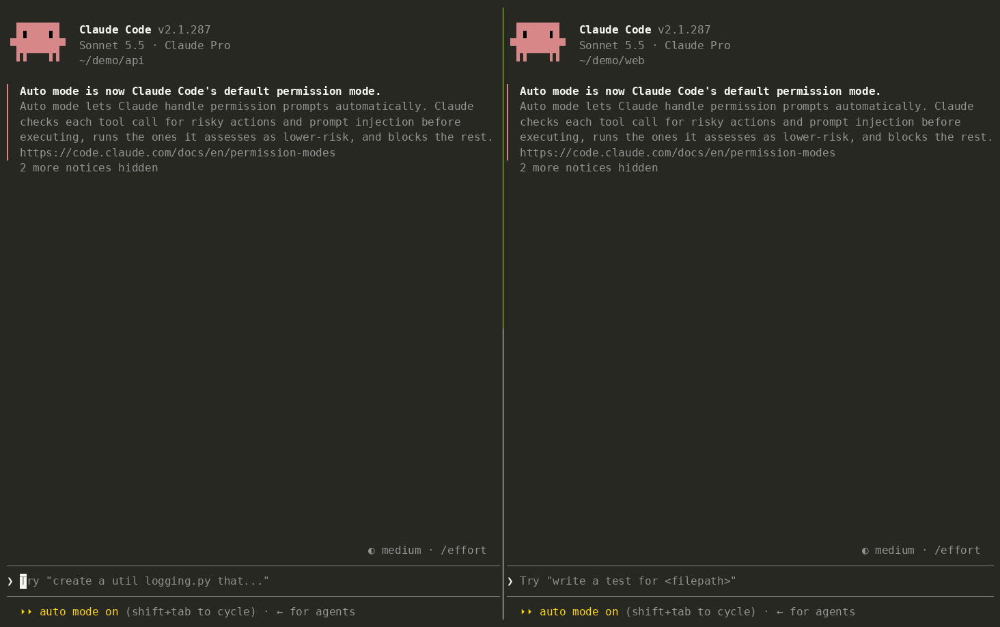
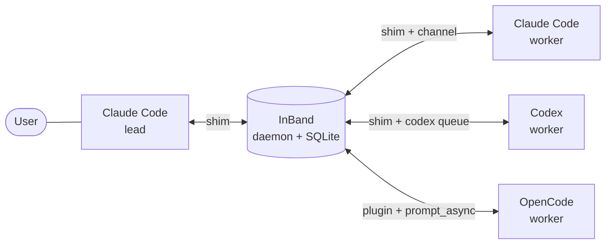

# InBand

[](https://github.com/ruipedro-pinheiro/InBand/actions/workflows/ci.yml)
[](LICENSE)

[Install](#install) · [Teams](#teams) · [Reference](docs/reference.md) · [Migrating from v1](docs/migration.md)

InBand is a message bus for coding agents. One local daemon carries mail
between Claude Code, Codex and OpenCode sessions, so a lead session can hand
tasks to worker sessions and get their results back.



```
send_message        # send to a mailbox of your team, or to "all" (the lead only)
wait_for_messages   # block until mail arrives
get_messages        # read the unread mail and mark it as read
get_history         # the mail you sent and received
ping                # the agents, their teams, roles and unread mail
```



## Features

- **One mailbox per session**, for Claude Code, Codex and OpenCode alike.
  SQLite stores the mail; it stays unread until `get_messages`.
- **Teams**: several teams, each with one lead. Workers write only to their
  lead, the lead writes to its workers, and nothing crosses teams. A session
  is solo, out of every team, until you put it in one.
- **Idle wake-up**: a channel for Claude Code, `codex queue` for Codex,
  `prompt_async` for OpenCode. The wake targets the exact session.
- **Sessions cannot impersonate each other**: the daemon checks which session
  calls, from the session that the client signs, never from the tool
  arguments. A worker cannot write as the lead, even when it is told to.
- **One static binary**, about 9 MB of memory, no runtime to install.

## Install

Linux, x86_64 or ARM64 (Raspberry Pi included).

```sh
git clone https://github.com/ruipedro-pinheiro/InBand
cd InBand
./install.sh
```

With Rust installed, `install.sh` builds InBand. Without it, it downloads the
static binary of the latest release and checks its SHA-256. Then it runs
`inband install`, which:

- installs `~/.local/bin/inband`, and the tokens and the config in
  `~/.local/share/mcp-servers/inband`;
- connects every client it finds: hooks, MCP server or plugin, and the team
  commands;
- starts the daemon as a systemd user service.

It is safe to run again, and it migrates a v1 install. Then:

- **Claude Code**: start it with
  `--dangerously-load-development-channels server:inband` to get mail as it
  arrives.
- **Codex**: trust the InBand hooks when it asks.
- **OpenCode**: start it with `--port 14096` so the daemon can wake it.

Agents on another machine than the daemon: `./install.sh --client`, see
[client machines](docs/reference.md#client-machines).

## Teams

Type in the session:

| Command      | Claude Code, OpenCode | Codex          |
| ------------ | --------------------- | -------------- |
| Lead team x  | `/lead x`             | `$lead x`      |
| Join team x  | `/join x`             | `$join x`      |
| Leave        | `/solo`               | `$solo`        |

A hook sees what you type and applies the command; a model cannot run it, and
neither can mail from another agent. A new lead turns the previous lead of the
team into a worker. A team can mix clients.

## Example

The lead calls `send_message`:

```
send_message(from: "claude-api-a1b2", to: "codex-019f6767-789c-73b2-bc5c-ac8575f29efd",
             content: "Run the test suite and report the failures.")
```

The daemon wakes that Codex session, which reads the mail and answers the lead
with `send_message`. A Claude Code worker gets the mail in its session:

```xml
<channel source="inband" from="claude-api-a1b2" from_role="lead"
         to="claude-web-c3d4" reply_via="send_message" sent_at="2026-10-01T20:47:58.816Z">
Run the test suite and report the failures.
</channel>
```

## Uninstall

```sh
systemctl --user disable --now inband
claude mcp remove --scope user inband
codex mcp remove inband
rm ~/.local/bin/inband ~/.config/opencode/plugin/inband.js
```

Then remove the hooks that run `inband hook` from `~/.claude/settings.json`
and `~/.codex/hooks.json`. `~/.local/share/mcp-servers/inband` holds the
tokens and the mail.

## Documentation

- [docs/reference.md](docs/reference.md): tools, teams, configuration,
  environment variables, security model, limits.
- [docs/migration.md](docs/migration.md): moving a v1 install to v2.

## Development

```sh
cargo test                                  # tests, attack tests included
cargo clippy --all-targets -- -D warnings   # lints
cargo fmt --check
```

## License

[MIT](LICENSE)
