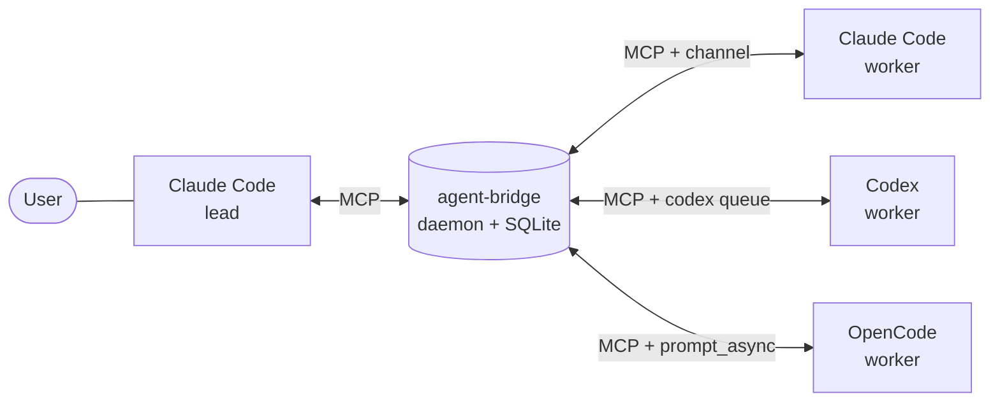

# agent-bridge

[](https://github.com/ruipedro-pinheiro/agent-bridge/actions/workflows/ci.yml)
[](LICENSE)
[](https://bun.sh)

[Install](#install) · [Example](#example) · [Reference](docs/reference.md)

agent-bridge is a message bus for coding agents. It runs as one local MCP
daemon. Claude Code, Codex and OpenCode sessions use it to send tasks and
results to each other.

```
send_message        # send to a mailbox, to "codex" (latest Codex session) or to "all"
wait_for_messages   # block until mail arrives
get_messages        # read the unread mail and mark it as read
ping                # list the agents, their roles and their unread mail
claim_lead          # make this session the lead (/lead)
```



## Features

- **Session mailboxes**: each Claude Code and Codex session gets a mailbox.
  SQLite stores the mail. Mail stays unread until `get_messages`.
- **Idle wake-up**: a channel for Claude Code, `codex queue` for Codex,
  `prompt_async` for OpenCode.
- **Lead and workers**: `/lead` selects the lead. The SessionStart hooks inject
  the role and the routing rules into each session.
- **Local auth**: loopback bind, one token per client family, HMAC-signed hook
  requests.

## Example

The lead calls `send_message`:

```
send_message(from: "claude-api-a1b2", to: "claude-web-c3d4",
             content: "Run the test suite and report the failures.")
```

The channel adds the message to the idle worker session:

```xml
<channel source="agent-bridge-channel" from="claude-api-a1b2" from_role="lead"
         to="claude-web-c3d4" reply_via="send_message" sent_at="2026-10-01T20:47:58.816Z">
Run the test suite and report the failures.
</channel>
```

The worker sends the result to the lead with `send_message`.

## Install

Linux, Bun 1.3+, bash 4.4+, `python3`, `curl`.

```sh
git clone https://github.com/ruipedro-pinheiro/agent-bridge ~/.local/share/mcp-servers/agent-bridge
cd ~/.local/share/mcp-servers/agent-bridge
./install.sh    # tokens, config, hooks, /lead, systemd user unit
```

Load the tokens, then register each client:

```sh
set -a; . ~/.local/share/mcp-servers/agent-bridge/tokens.env; set +a
```

<details>
<summary>Claude Code</summary>

```sh
claude mcp add --scope user --transport http agent-bridge http://127.0.0.1:7447/mcp \
  --header "Authorization: Bearer $AGENT_BRIDGE_CLAUDE_TOKEN"
claude mcp add --scope user agent-bridge-channel -- \
  bun ~/.local/share/mcp-servers/agent-bridge/src/channel-shim.ts

# start with the channel
claude --dangerously-load-development-channels server:agent-bridge-channel
```

</details>

<details>
<summary>Codex</summary>

```sh
codex mcp add agent-bridge --url http://127.0.0.1:7447/mcp \
  --bearer-token-env-var AGENT_BRIDGE_CODEX_TOKEN

# start from the shell that loaded tokens.env, then trust the agent-bridge hooks
codex
```

Wakes require a Codex CLI with the `queue` command.

</details>

<details>
<summary>OpenCode</summary>

```sh
opencode mcp add agent-bridge --url http://127.0.0.1:7447/mcp \
  --header "Authorization=Bearer $AGENT_BRIDGE_OPENCODE_TOKEN"

# the daemon wakes OpenCode on this port
opencode --port 14096
```

The daemon supports one OpenCode session at a time.

</details>

In the lead session, run `/lead` (`/prompts:lead` in Codex).

Agents on a second machine: [client machines](docs/reference.md#client-machines).

## Uninstall

```sh
systemctl --user disable --now agent-bridge
claude mcp remove agent-bridge --scope user
claude mcp remove agent-bridge-channel --scope user
codex mcp remove agent-bridge
```

Then remove the agent-bridge entries from `~/.claude/settings.json`,
`~/.codex/hooks.json` and the OpenCode configuration.

## Documentation

[docs/reference.md](docs/reference.md): tools, configuration, environment
variables, security model, limits.

## Development

```sh
bun test                      # tests
bun run typecheck             # tsc
bun run prepublish:security   # no tracked secrets, private files in mode 600
```

## License

[MIT](LICENSE)
