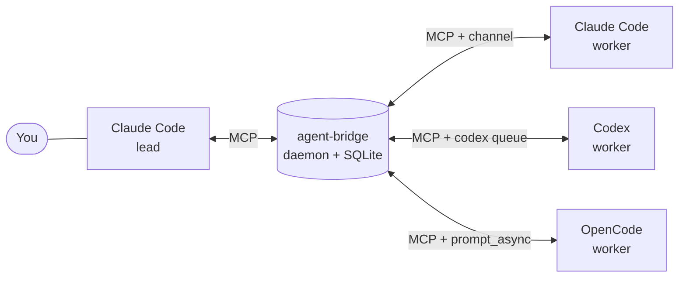

# agent-bridge

[](https://github.com/ruipedro-pinheiro/agent-bridge/actions/workflows/ci.yml)
[](LICENSE)
[](https://bun.sh)

[Install](#install) · [Usage](#usage) · [Reference](docs/reference.md)

agent-bridge is a local MCP server that lets Claude Code, Codex and OpenCode
sessions send messages to each other. You talk to one session, the lead, and
the lead hands work to the other sessions through the bridge.



## Features

- **Mailboxes.** Each Claude Code and Codex session has its own mailbox.
  OpenCode has one fixed mailbox, so one OpenCode session at a time.
- **Delivery to idle sessions.** Claude Code receives mail through a channel,
  Codex through `codex queue` (a Codex CLI with `queue` is required) and
  OpenCode through its HTTP API.
- **Lead and workers.** `/lead` selects the session that talks to you. Claude
  Code and Codex sessions get their role and the routing rules when they start.
- **Persistent mail.** Messages are stored in SQLite and stay unread until the
  recipient reads them.
- **Local and authenticated.** The daemon listens on loopback. Each client
  family has its own token.

## Usage

The agents call the MCP tools themselves. Here the lead calls `send_message`:

```
send_message(from: "claude-api-a1b2", to: "claude-web-c3d4",
             content: "Run the test suite and report the failures.")
```

The worker is idle. The channel inserts the message into its session:

```xml
<channel source="agent-bridge-channel" from="claude-api-a1b2" from_role="lead"
         to="claude-web-c3d4" reply_via="send_message" sent_at="2026-10-01T20:47:58.816Z">
Run the test suite and report the failures.
</channel>
```

The worker runs the tests and replies with `send_message` to
`claude-api-a1b2`. The reply reaches the lead the same way.

## Install

Requirements: Linux, [Bun](https://bun.sh) 1.3 or later, bash 4.4 or later,
`python3` and `curl`. systemd is optional.

### 1. Install the daemon

```sh
git clone https://github.com/ruipedro-pinheiro/agent-bridge ~/.local/share/mcp-servers/agent-bridge
cd ~/.local/share/mcp-servers/agent-bridge
./install.sh
```

The installer creates `tokens.env` and `config.json`, installs the hooks of
Claude Code and Codex and the `/lead` commands, and starts a systemd user
service. See the [installer options](docs/reference.md#installer).

### 2. Connect your agents

Load the tokens first:

```sh
set -a; . ~/.local/share/mcp-servers/agent-bridge/tokens.env; set +a
```

<details>
<summary>Claude Code</summary>

```sh
claude mcp add --scope user --transport http agent-bridge http://127.0.0.1:7447/mcp \
  --header "Authorization: Bearer $AGENT_BRIDGE_CLAUDE_TOKEN"
claude mcp add --scope user agent-bridge-channel -- \
  bun ~/.local/share/mcp-servers/agent-bridge/src/channel-shim.ts
```

Start Claude Code with the channel:

```sh
claude --dangerously-load-development-channels server:agent-bridge-channel
```

</details>

<details>
<summary>Codex</summary>

```sh
codex mcp add agent-bridge --url http://127.0.0.1:7447/mcp \
  --bearer-token-env-var AGENT_BRIDGE_CODEX_TOKEN
```

Start `codex` from a shell where `AGENT_BRIDGE_CODEX_TOKEN` is exported. On the
first start, Codex asks you to trust the agent-bridge hooks.

</details>

<details>
<summary>OpenCode</summary>

```sh
opencode mcp add agent-bridge --url http://127.0.0.1:7447/mcp \
  --header "Authorization=Bearer $AGENT_BRIDGE_OPENCODE_TOKEN"
```

Start OpenCode with `opencode --port 14096` to let the daemon wake it.

</details>

### 3. Choose the lead

Run `/lead` in the session you talk to. In Codex, the command is
`/prompts:lead`.

To use agents on a second machine through an SSH tunnel, see
[Client machines](docs/reference.md#client-machines).

## Uninstall

```sh
systemctl --user disable --now agent-bridge
claude mcp remove agent-bridge --scope user
claude mcp remove agent-bridge-channel --scope user
codex mcp remove agent-bridge
```

Then remove the `agent-bridge` server from the OpenCode configuration, the
agent-bridge entries from `~/.claude/settings.json` and `~/.codex/hooks.json`,
the `lead.md` files, and the repository directory.

## Documentation

[docs/reference.md](docs/reference.md) covers the tools, the configuration,
the environment variables, the security model and the known limits.

## Development

```sh
bun test
bun run typecheck
bun run prepublish:security
```

## License

[MIT](LICENSE)
